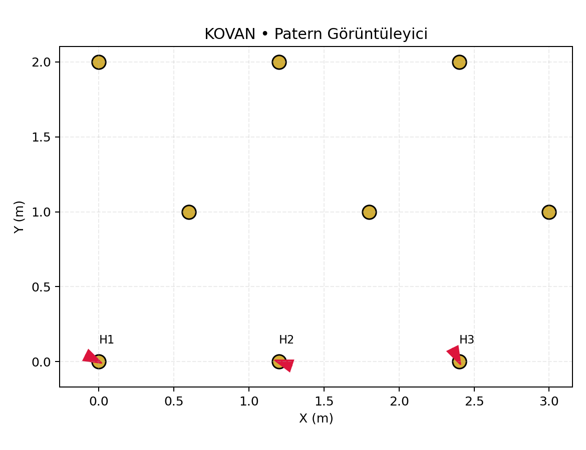

# KOVAN — Yeraltı Delme Asistanı (PoC)
Jumbolarda **desene-uyumlu hizalama** ve **delik-bazlı raporlama** için çok basit bir demo.

🔗 Canlı önizleme: https://oguzcenkyilmaz6-cmd.github.io/KOVAN/

## Ne görüyorsun?
Aşağıdaki görsel, örnek delme paternini ve bazı deliklerdeki küçük giriş sapmalarını gösterir.

## Hızlı deneme (kolay yol)
- Bu repodaki `demo/sample_iredes.xml` dosyası örnek patern verisidir.
- `demo/kovan_viewer.py` dosyasını çalıştırınca `demo/out_pattern.png` üretilir.
- Bilgisayara kurulum yapmak istemiyorsan **Google Colab** açıp şu tek hücreyi çalıştır:
  - `demo/sample_iredes.xml` içeriğini ve çizim kodunu kopyalayıp çalıştır → `out_pattern.png`’yi indir.

## Yol Haritası (kısa)
- [ ] IREDES dosyası içe aktarma (plan & MWD)
- [ ] Canlı hizalama ekranı (simülasyon)
- [ ] CSV/PDF rapor
- [ ] Saha “gölge mod” pilotu

## Katkı (contributing)
- “Issues” sekmesindeki **good first issue** etiketliler ideal başlangıç.
- PR atarken ekran görüntüsü ekle ve kısa açıklama yaz.
